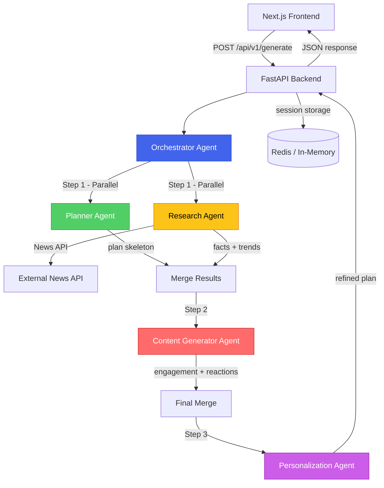

# Conversation Intelligence Agent

AI-powered conversation strategy generator for meetings, conferences, gatherings, and public talks. Uses a multi-agent architecture to produce structured, engaging conversation plans tailored to your audience, tone, and context.

---

## Architecture



### Agent Pipeline

| Step | Agent(s) | Purpose |
|------|----------|---------|
| 1 | **Planner** + **Researcher** (parallel) | Generate conversation skeleton + gather facts/trends |
| 2 | **Content Generator** | Create engagement strategies, reactions, humor |
| 3 | **Personalizer** | Refine tone, language complexity, cultural fit |

All agents are coordinated by the **Orchestrator** which manages the LangGraph-style workflow.

---

## Tech Stack

| Layer | Technology |
|-------|-----------|
| Frontend | Next.js 14, React 18, Tailwind CSS |
| Backend | Python 3.12, FastAPI |
| AI | LangChain + OpenAI / Anthropic |
| Memory | Redis (with in-memory fallback) |
| Search | NewsAPI for real-time content |
| PDF Export | fpdf2 |
| Deployment | Docker Compose, Vercel, AWS/GCP |

---

## Project Structure

```
conversation_Intelli_agent/
├── backend/
│   ├── app/
│   │   ├── agents/
│   │   │   ├── orchestrator.py    # Coordinates all agents
│   │   │   ├── planner.py         # Conversation strategy planner
│   │   │   ├── researcher.py      # Facts, trends, news
│   │   │   ├── content_generator.py # Engagement & reactions
│   │   │   └── personalizer.py    # Tone & audience adaptation
│   │   ├── api/
│   │   │   └── routes.py          # API endpoints
│   │   ├── core/
│   │   │   └── config.py          # Settings & env vars
│   │   ├── models/
│   │   │   └── schemas.py         # Pydantic models
│   │   ├── services/
│   │   │   ├── llm.py             # LLM client abstraction
│   │   │   ├── memory.py          # Session storage
│   │   │   └── news.py            # News API client
│   │   └── main.py                # FastAPI app entry
│   ├── tests/
│   │   └── test_api.py
│   ├── Dockerfile
│   ├── requirements.txt
│   └── .env.example
├── frontend/
│   ├── src/
│   │   ├── app/
│   │   │   ├── layout.tsx
│   │   │   ├── page.tsx           # Main page
│   │   │   └── globals.css
│   │   ├── components/
│   │   │   ├── InputForm.tsx      # User input form
│   │   │   ├── ResultsDashboard.tsx # Results display
│   │   │   └── RefinePanel.tsx    # Refine & export actions
│   │   └── lib/
│   │       ├── api.ts             # API client
│   │       └── constants.ts       # Form options
│   ├── Dockerfile
│   ├── package.json
│   └── .env.example
├── docker-compose.yml
└── README.md
```

---

## Quick Start

### Prerequisites

- Python 3.11+
- Node.js 18+
- An OpenAI or Anthropic API key

### 1. Backend

```bash
cd backend
python -m venv .venv
source .venv/bin/activate  # Windows: .venv\Scripts\activate
pip install -r requirements.txt

# Configure
cp .env.example .env
# Edit .env and add your API key

# Run
uvicorn app.main:app --reload --port 8000
```

### 2. Frontend

```bash
cd frontend
npm install

# Configure
cp .env.example .env.local

# Run
npm run dev
```

Open **http://localhost:3000** in your browser.

### 3. Docker (Full Stack)

```bash
# Copy and configure env
cp backend/.env.example backend/.env
# Edit backend/.env with your API key

docker-compose up --build
```

Frontend: http://localhost:3000 | Backend: http://localhost:8000 | API Docs: http://localhost:8000/docs

---

## API Endpoints

| Method | Endpoint | Description |
|--------|----------|-------------|
| `POST` | `/api/v1/generate` | Generate a conversation plan |
| `POST` | `/api/v1/refine` | Refine an existing plan |
| `GET` | `/api/v1/session/{id}` | Retrieve a stored session |
| `POST` | `/api/v1/export/{id}` | Export plan as PDF |
| `GET` | `/health` | Health check |

---

## Output Format

```json
{
  "session_id": "uuid",
  "plan": {
    "opening_lines": ["Hello everyone! Quick show of hands..."],
    "topic_flow": ["Introduction to AI trends", "Impact on healthcare", "Q&A"],
    "questions": ["What's your experience with AI tools?"],
    "reactions": {
      "agreement": ["Great point! Let me build on that..."],
      "disagreement": ["I appreciate that perspective. Here's another angle..."],
      "silence": ["Let me rephrase — who here has used ChatGPT?"],
      "confusion": ["Let me break that down with a simple analogy..."]
    },
    "engagement_strategies": ["Use the 'raise your hand if...' technique"],
    "fun_elements": ["AI joke: Why did the neural network go to therapy?"],
    "facts": ["The global AI market is projected to reach $1.8T by 2030"],
    "recent_topics": ["Latest developments in multimodal AI models"],
    "transition_phrases": ["Speaking of which...", "That reminds me of..."],
    "poll_ideas": ["Quick poll: How many of you use AI daily at work?"]
  },
  "metadata": {
    "topic": "technology",
    "audience": "technical",
    "tone": "informative"
  }
}
```

---

## Example Scenarios

### 1. Technical Conference (AI topic, serious tone)

**Input:**
- Topic: Technology (custom: "AI in Healthcare")
- Audience: Technical
- Tone: Serious
- Context: Conference
- Role: Speaker
- Audience size: 200

**Expected output:** Detailed technical opening, structured topic progression from fundamentals to cutting-edge research, data-driven facts, thought-provoking questions about ethics and implementation.

### 2. Family Gathering (casual, funny)

**Input:**
- Topic: Personal/Social
- Audience: Family
- Tone: Funny
- Context: Party
- Duration: 60 min

**Expected output:** Light-hearted icebreakers, relatable family humor, nostalgic conversation starters, fun trivia, easy group activities.

### 3. Networking Event (unknown audience)

**Input:**
- Topic: Business
- Audience: Unknown
- Tone: Networking
- Context: Meeting
- Role: Attendee
- Location: New York

**Expected output:** Professional but approachable openers, industry-relevant talking points, NYC-localized references, relationship-building questions, graceful exit phrases.

---

## Deployment

### Vercel (Frontend)

```bash
cd frontend
npx vercel --prod
```

Set `NEXT_PUBLIC_API_URL` to your backend URL in Vercel environment variables.

### AWS / GCP / Azure (Backend)

**Option A: Docker on EC2/GCE/Azure VM**
```bash
docker build -t cia-backend ./backend
docker run -p 8000:8000 --env-file backend/.env cia-backend
```

**Option B: AWS ECS / GCP Cloud Run**
```bash
# Push to container registry
docker tag cia-backend:latest <registry>/cia-backend:latest
docker push <registry>/cia-backend:latest
# Deploy via ECS task definition or Cloud Run service
```

---

## Configuration

| Variable | Default | Description |
|----------|---------|-------------|
| `AI_PROVIDER` | `openai` | `openai` or `anthropic` |
| `AI_MODEL` | `gpt-4o` | Model name |
| `OPENAI_API_KEY` | — | OpenAI API key |
| `ANTHROPIC_API_KEY` | — | Anthropic API key |
| `REDIS_URL` | — | Redis connection URL (optional) |
| `NEWS_API_KEY` | — | NewsAPI.org key (optional) |
| `CORS_ORIGINS` | `["http://localhost:3000"]` | Allowed CORS origins |

---

## License

MIT
